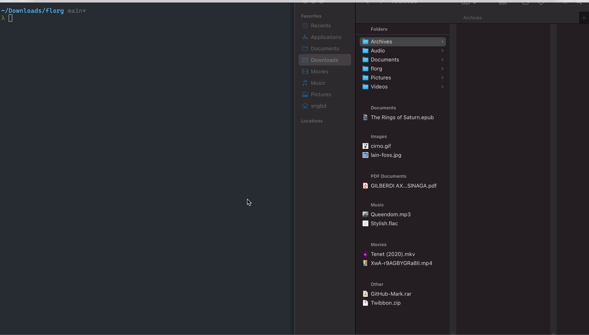

# florg
A simple shell script that organizes files with specific extension in download directory (default) by moving them to respective directories.

## Demo

## Setup
1. `git clone https://github.com/sngbd/florg.git`
2. Edit `config` contents (home directory, paths, file extensions, etc) to suit your machine and needs
3. Make `florg` executable: `chmod +x florg`
4. Place `florg` and `config` in your local bin directory or alike directory to run it more conveniently (locally, sans dot-slash prefix)
5. You might as well configure the script with `crontab` to run it periodically.
